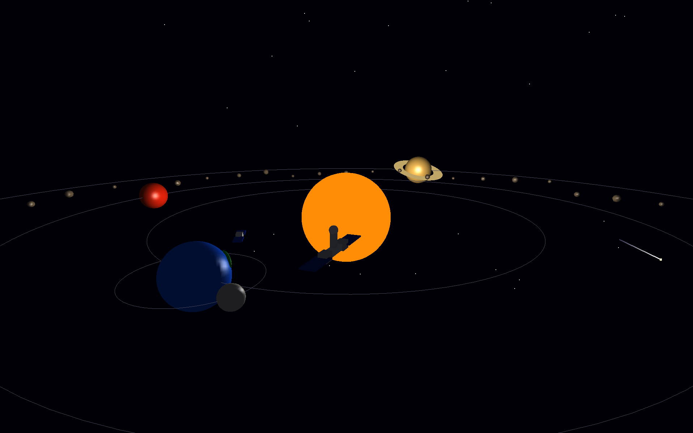
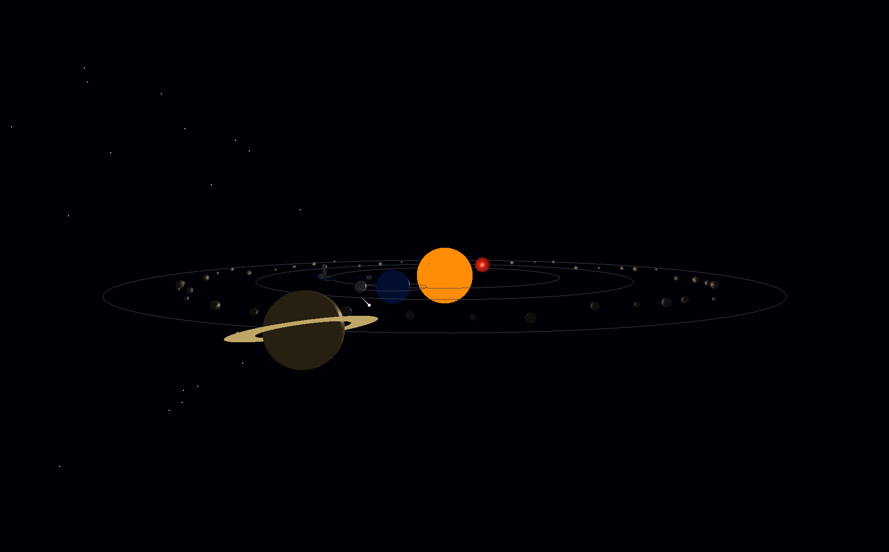
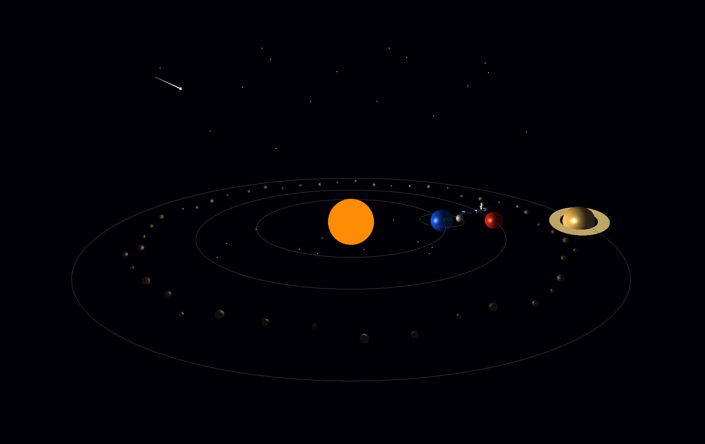

# 🌌 3D Space Station & Solar System Simulation

<p align="center">
  <b>An Interactive 3D Solar System & Space Station Simulation built with C++, OpenGL and GLUT</b>
</p>

<p align="center">
  
  
  
  
</p>

---

## 🚀 About the Project

**3D Space Station & Solar System Simulation** is an interactive computer graphics project developed using **C++, OpenGL, and GLUT**.

The project presents an animated 3D space environment containing the **Sun, Earth, Moon, Mars, Saturn, asteroid belt, satellite, and an ISS-style space station**.

It demonstrates important computer graphics concepts including **3D transformations, hierarchical modeling, orbital animation, perspective projection, lighting, depth testing, camera movement, and real-time interaction**.

---

## ✨ Features

- ☀️ 3D animated Sun
- 🌍 Earth orbiting around the Sun
- 🌙 Moon orbiting around Earth
- 🔴 Animated Mars
- 🪐 Saturn with a 3D planetary ring
- ☄️ Asteroid belt
- 🛰️ Artificial satellite orbiting Earth
- 🛸 ISS-style space station
- 🌠 Animated shooting star
- ⭐ Space star field
- 💡 Dynamic OpenGL lighting
- 🔄 Planet self-rotation
- 🌀 Hierarchical orbital animation
- 🎥 Multiple camera views
- 🎮 Interactive keyboard controls
- ⏯️ Pause and resume simulation
- 🖥️ Full-screen rendering
- 📐 Perspective projection
- 🔲 Depth-buffered 3D rendering

---

## 🎥 Project Preview

### 🌌 Main Solar System View

<p align="center">
  
</p>

### 🛰️ Earth & Space Station

<p align="center">
  
</p>

### 🪐 Saturn & Asteroid Belt

<p align="center">
  
</p>

---

## 🎮 Controls

| Key | Action |
|:---:|---|
| `W` | Move Camera Forward |
| `S` | Move Camera Backward |
| `A` | Move Camera Left |
| `D` | Move Camera Right |
| `↑` | Move Camera Up |
| `↓` | Move Camera Down |
| `←` | Move Camera Left |
| `→` | Move Camera Right |
| `1` | Main Camera View |
| `2` | Top Camera View |
| `3` | Side Camera View |
| `R` | Reset Camera |
| `SPACE` | Pause / Resume Animation |
| `ESC` | Exit Simulation |

---

## 🪐 Simulation Structure

```text
                         Moon
                          │
                          ▼
                     ┌─────────┐
                     │  Earth  │
                     └─────────┘
                      /       \
               Satellite   Space Station

                         Sun
                    /     |      \
                 Earth   Mars   Saturn
                               
                      Asteroid Belt
```

The project uses **hierarchical transformations**, allowing each object to maintain its own rotation while simultaneously orbiting another object.

```text
Sun
 ├── Earth Orbit
 │    ├── Earth Rotation
 │    ├── Moon Orbit
 │    │    └── Moon Rotation
 │    ├── Satellite Orbit
 │    └── Space Station Orbit
 │
 ├── Mars Orbit
 │    └── Mars Rotation
 │
 └── Saturn Orbit
      └── Saturn Rotation

Asteroid Belt
```

---

## 🛠️ Technologies Used

| Technology | Purpose |
|---|---|
| **C++** | Core programming language |
| **OpenGL** | 3D graphics rendering |
| **GLUT** | Window management and user input |
| **GLU** | Perspective projection and camera utilities |
| **Code::Blocks** | Development environment |
| **MinGW** | C++ compiler |

---

## 🧠 Computer Graphics Concepts

### 🔹 Translation

`glTranslatef()` is used to position planets, satellites, the space station, and other objects in the 3D environment.

### 🔹 Rotation

`glRotatef()` controls planetary self-rotation and orbital movement.

### 🔹 Scaling

`glScalef()` is used to resize 3D objects and construct components of the satellite and space station.

### 🔹 Hierarchical Modeling

`glPushMatrix()` and `glPopMatrix()` isolate transformations and allow objects such as the Moon, satellite, and space station to move relative to Earth.

### 🔹 Perspective Projection

`gluPerspective()` creates the 3D perspective projection used by the simulation.

### 🔹 Camera System

`gluLookAt()` provides an interactive camera system with multiple viewpoints.

### 🔹 Lighting

OpenGL lighting and material properties are used to illuminate the planets and 3D objects.

### 🔹 Depth Testing

`GL_DEPTH_TEST` ensures that objects closer to the camera correctly appear in front of objects farther away.

### 🔹 Animation

`glutTimerFunc()` continuously updates orbital positions, planetary rotations, and other animated objects.

---

## 📂 Project Structure

```text
3D-Space-Station-Solar-System-Simulation/
│
├── main.cpp
├── 3D Space Station & Solar System Simulation.cbp
├── README.md
│
├── Screenshot/
│   ├── solar-system.png
│   ├── space-station.png
│   └── saturn.png
│
├── bin/
└── obj/
```

---

## ⚙️ How to Run

### Requirements

Make sure the following are installed and configured:

- C++ Compiler
- OpenGL
- GLUT / FreeGLUT
- Code::Blocks or another compatible C++ IDE

### 1. Clone the Repository

```bash
git clone https://github.com/Tashin90/3D-Space-Station-Solar-System-Simulation.git
```

### 2. Open the Project

Open the following Code::Blocks project file:

```text
3D Space Station & Solar System Simulation.cbp
```

### 3. Configure Required Libraries

Make sure the required OpenGL and GLUT libraries are correctly configured.

### 4. Build & Run

Build the project in Code::Blocks and run the application.

---

## 🔗 Required Libraries

The project uses the following libraries:

```text
opengl32
glu32
glut32 / freeglut
```

Main headers:

```cpp
#include <windows.h>
#include <GL/glut.h>
#include <math.h>
#include <stdlib.h>
```

---

## 🔄 Animation System

The simulation uses different orbital speeds for the planets and Earth-based objects.

```cpp
earthOrbit += 0.30f;
marsOrbit += 0.20f;
saturnOrbit += 0.10f;

moonOrbit += 1.8f;
satelliteOrbit += 2.8f;
stationOrbit += 1.0f;
```

The animation is continuously updated using:

```cpp
glutTimerFunc(20, update, 0);
```

This creates continuous orbital and rotational motion throughout the simulation.

---

## 🎯 Project Objectives

The main objectives of this project are:

- Understand and implement 3D transformations
- Implement hierarchical object relationships
- Create real-time 3D animations
- Simulate orbital and rotational motion
- Apply OpenGL lighting and material properties
- Implement perspective projection
- Implement interactive camera movement
- Understand depth-buffered 3D rendering
- Develop a complete 3D scenario using OpenGL and GLUT

---

## 🔮 Future Improvements

Future versions of the project may include:

- 🌎 Detailed planet textures
- 🌌 3D skybox
- ☀️ Enhanced Sun effects
- 🪐 Additional planets
- 🛰️ More detailed space station model
- 🚀 Animated spacecraft
- 🌑 Dynamic shadows
- 🎥 Cinematic camera animations
- 🔊 Space-themed background audio
- 🖱️ Mouse-controlled camera system

---

## 👨‍💻 Author

**MD. Naimul Haque Tashin**

Computer Science  
American International University-Bangladesh (AIUB)

GitHub: [@Tashin90](https://github.com/Tashin90)

---

## ⭐ Support

If you find this project interesting, consider giving the repository a **⭐ Star**.

It helps support the project and future improvements.

---

<p align="center">
  <b>Made with ❤️ using C++, OpenGL & GLUT</b>
</p>
